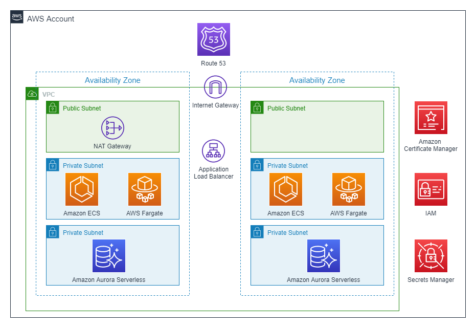
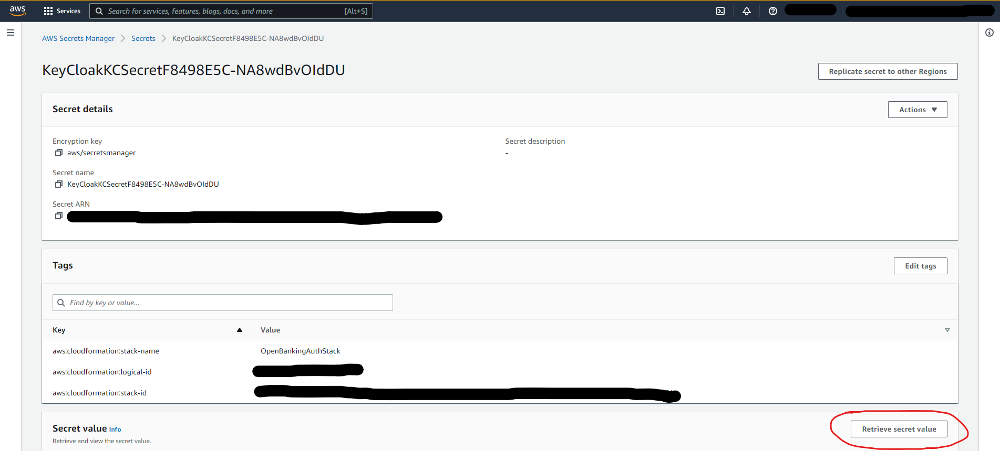
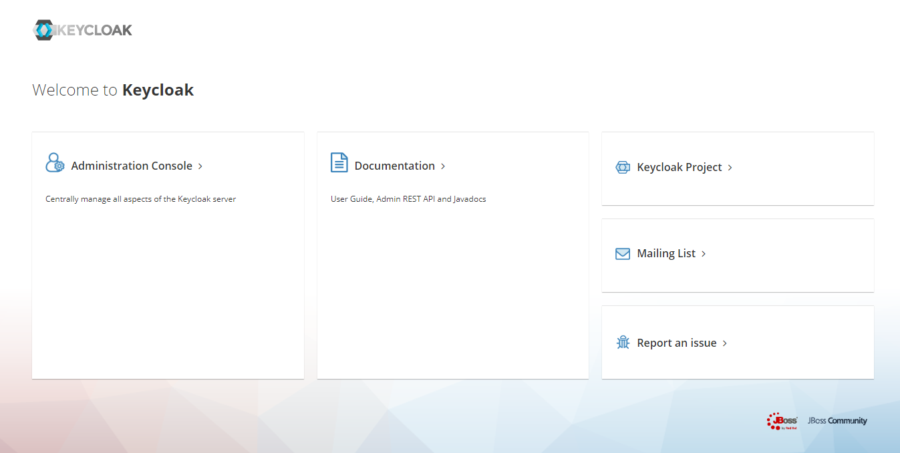
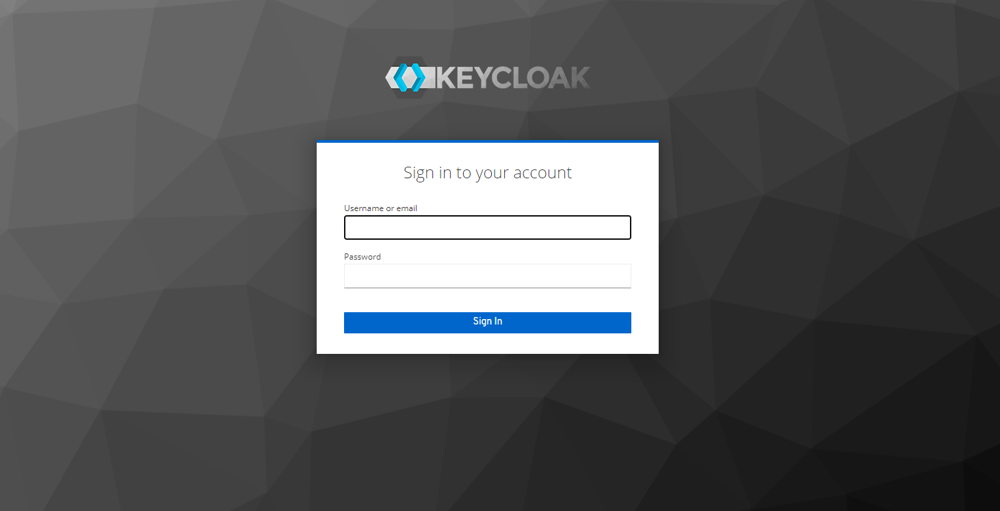

# Open Banking Brazil - Keycloak OIDC Provider

## Overview

This repo intends to demonstrate how to address the OAuth2-based authorization security requirement for Brazilian Open Banking to use Amazon API Gateway to protect and authorize API accesses using an external [FAPI-compliant OIDC provider - Keycloak](https://www.keycloak.org/) running on a Container with AWS ECS Fargate.

*** 

## Prerequisites:

- [awscli](https://docs.aws.amazon.com/cli/latest/userguide/cli-chap-install.html)
- [Pre configured AWS credentials](https://docs.aws.amazon.com/cli/latest/userguide/cli-configure-files.html)
- [npm](https://docs.npmjs.com/downloading-and-installing-node-js-and-npm)
- [cdk-v2](https://docs.aws.amazon.com/cdk/latest/guide/getting_started.html)
- [A Route 53 Public Hosted Zone configured to a DNS](https://docs.aws.amazon.com/Route53/latest/DeveloperGuide/AboutHZWorkingWith.html)
- [A Public Certificate issued to your Domain Name using ACM](https://docs.aws.amazon.com/acm/latest/userguide/gs-acm-request-public.html)


## 1. Deploy the CDK Stack


### 1.1. Clone the repository

```sh
git clone <REPO_URL>

cd <REPO_NAME>
```


### 1.2. Configure Environment Variables

Now, make sure to set the following env variables in the `.env` file:

| Key   |      Value      |      Description      |
|----------|:-------------:|-----------------------:|
| ACM_CERT_ARN |  arn:aws:acm:<region>:<account_id>:certificate/abc-123 | Your existing Amazon Certificate Manager (ACM) public certificate ARN |
| R53_ZONE_NAME | example.com | Your existing Route 53 public zone name (e.g. example.com) |
| R53_DOMAIN_NAME | oidc.example.com | The desired domain name to host your OIDC application (e.g. oidc.example.com). A record will be created. |


### 1.3. Deploy the CDK Stack

```sh
npm install

cdk bootstrap -c ACM_CERT_ARN=<YOUR_ACM_CERTIFICATE_ARN>

cdk deploy -c ACM_CERT_ARN=<YOUR_ACM_CERTIFICATE_ARN>
```

CDK will then bootstrap an environment in your account. It will then synthetize a **AWS Cloudformation template** and finally deploy it. The end result will be the following architecture: 



The cdk will generate the following output:

`OpenBankingAuthStack.KeyCloakDatabaseDBSecretArn28BEB641 = [ARN of Secrets (Secrets Manager) of Aurora Serverless database]`
`OpenBankingAuthStack.KeyCloakDatabaseclusterEndpointHostname38FB0D1E = [Endpoint URL for Aurora Serverless database]`
`OpenBankingAuthStack.KeyCloakDatabaseclusterIdentifierF00C290B = [Id of Aurora Serverless database]`
`OpenBankingAuthStack.KeyCloakKeyCloakContainerSerivceEndpointURL9C81E19A = [Endpoint URL for Keycloak Load Balancer]`
`Stack ARN: [CloudFormation Stack ARN]`


## 2. Test Your OIDC Keycloak 

First you need to get your keycloak Administrator credentials stored in the **AWS Secrets Manager** (via AWS Console or AWS CLI).




### 2.1. Test Your OIDC Keycloak  - Using Web Interface

1. Access your OIDC Keycloak using the `R53_DOMAIN_NAME` created in step 1. Example: https://oidc.anycompany.com.


1. Click on Administration Console link.

1. Login with the username and password retrieved in the beggining of step 2.



### 2.2. Test Your OIDC Keycloak  - Using Keycloak APIs

### List all endpoints

```CURL -X GET https://<<YOUR-DOMAIN>>/auth/realms/master/.well-known/openid-configuration```


### Generate Access Token (JWT)


```curl -X POST 'https://<<YOUR-DOMAIN>>/auth/realms/master/protocol/openid-connect/token' -H "Content-Type: application/x-www-form-urlencoded" -d "username=keycloak" -d "password=<<YOUR-PASSWORD>>" -d "grant_type=password" -d 'client_id=admin-cli' |jq -r '.access_token'```

### Get OIDC Signature 

```CURL -X GET https://<<YOUR-DOMAIN>>/auth/realms/master/protocol/openid-connect/certs```


For complete Keycloak documentation see [Keycloak Documentation](https://www.keycloak.org/documentation.html) and [Keycloak Admin REST API](https://www.keycloak.org/docs-api/18.0/rest-api/index.html)

## 3. Use Keycloak as Lambda Authorizer OIDC Provider

You can integrate Keycloak OIDC to Lambda Authorizer to provide authentication and authorization to your APIs in AWS. 

To test, see <<repo-name>>

## 4. Cleaning UP

Run the following command:

```sh
cdk destroy -c ACM_CERT_ARN=<YOUR_ACM_CERTIFICATE_ARN>
```


## 5. Security

See [CONTRIBUTING](CONTRIBUTING.md#security-issue-notifications) for more information.


## 6. License

[](https://opensource.org/licenses/MIT)
This project is licensed under the MIT-0 License. See the LICENSE.MIT-0 file.


